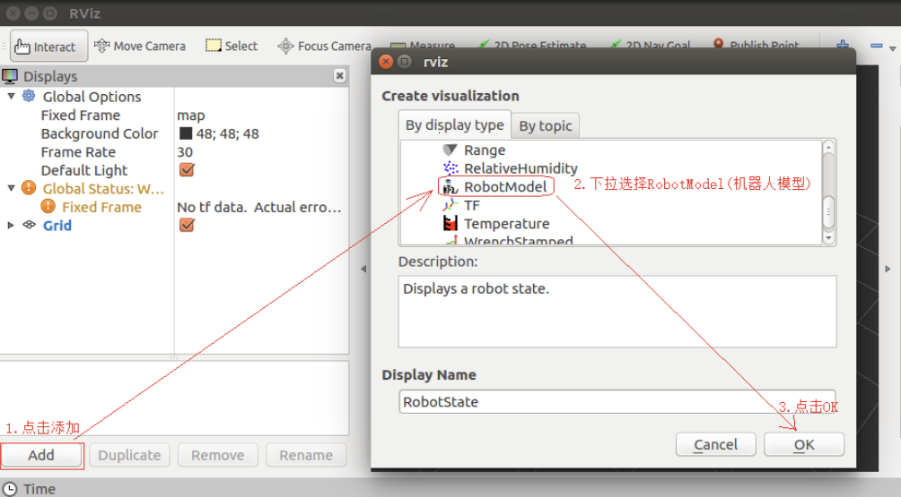
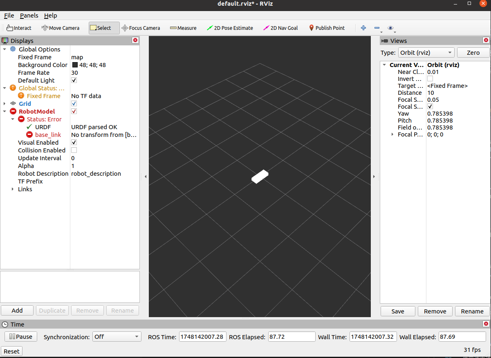
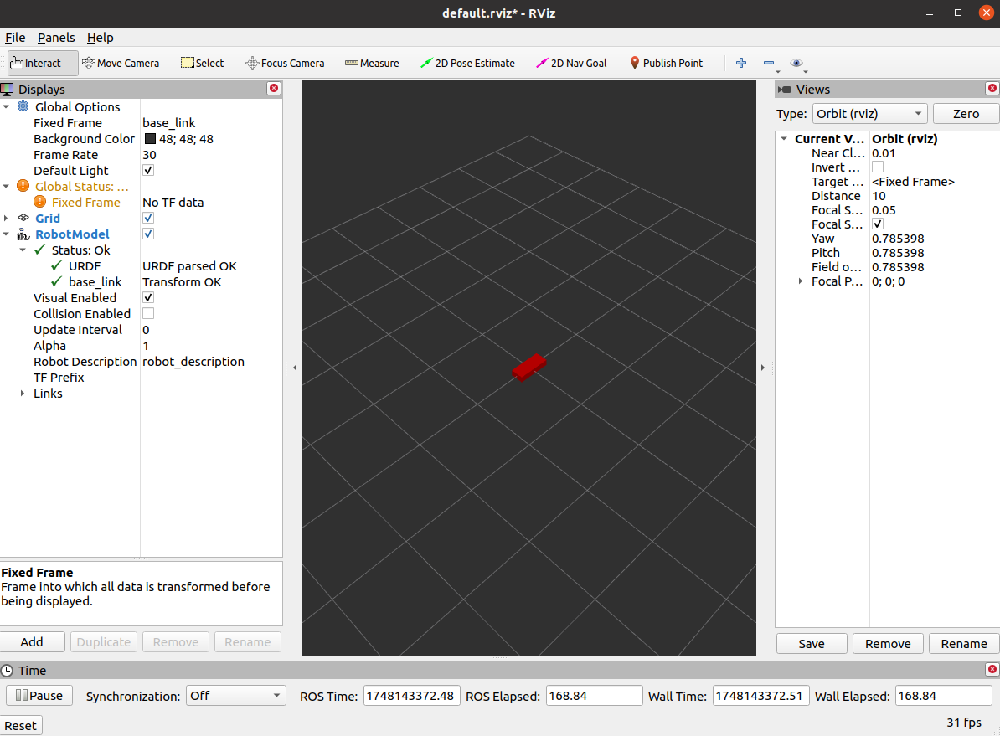
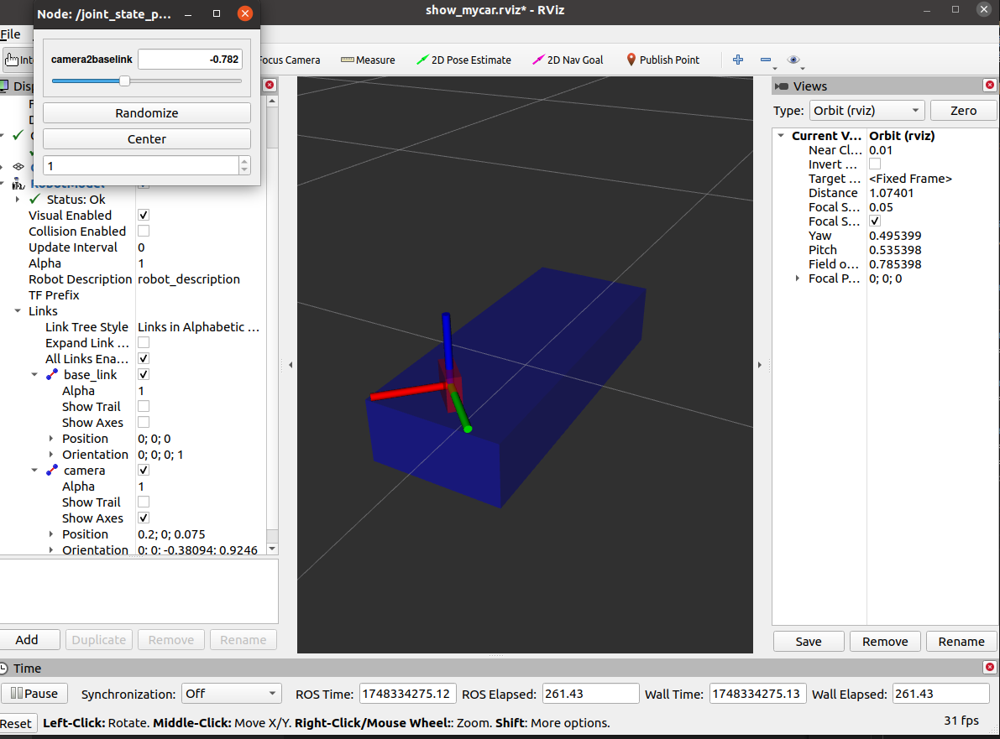
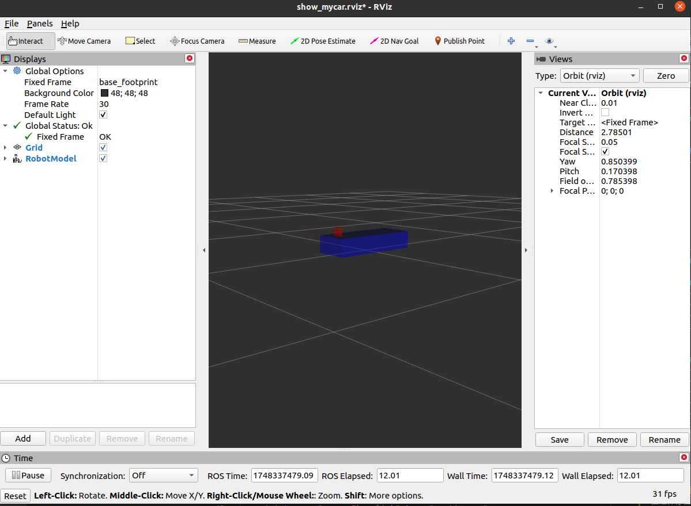
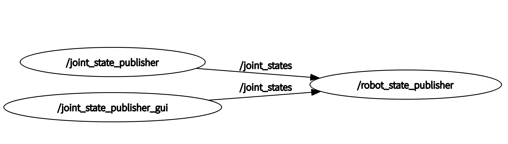

# URDF机器人仿真建模

## 为什么我们需要机器人仿真？
- `低成本`:当前机器人成本居高不下，动辄几十万，仿真可以大大降低成本，减小风险
- `高效`:搭建的环境更为多样且灵活，可以提高测试效率以及测试覆盖率
- `高安全性`:仿真环境下，无需考虑耗损问题

仿真具有诸如以上的优点，但同样也存在一定的缺陷：

- 仿真器所使用的物理引擎目前还不能够完全精确模拟真实世界的物理情况
- 仿真器构建的是关节驱动器（电机&齿轮箱）、传感器与信号通信的绝对理想情况，目前不支持模拟实际硬件缺陷或者一些临界状态等情形

## 常用来进行机器人仿真的工具

### `URDF`
`URDF`是 `Unified Robot Description Format` 的首字母缩写，直译为统一(标准化)机器人描述格式，可以以一种 XML 的方式描述机器人的部分结构，比如底盘、摄像头、激光雷达、机械臂以及不同关节的自由度.....,该文件可以被 `C++` 内置的解释器转换成可视化的机器人模型，是 ROS 中实现机器人仿真的重要组件。\
简而言之，我们通常使用URDF来进行机器人的本体建模

### `Rviz`
`RViz` 是 `ROS Visualization Tool` 的首字母缩写，直译为ROS的三维可视化工具。\
它的主要目的是以三维方式显示`ROS`消息，可以将数据进行可视化表达。例如:可以显示机器人模型，可以无需编程就能表达激光测距仪（LRF）传感器中的传感器到障碍物的距离，`RealSense`、`Kinect`或`Xtion`等三维距离传感器的点云数据（PCD， Point Cloud Data），从相机获取的图像值等。\
通常，我们使用`Rviz`来进行机器人运动与感知数据的可视化。

### `Gazebo`
`Gazebo`是一款3D动态模拟器，用于显示机器人模型并创建仿真环境,能够在复杂的室内和室外环境中准确有效地模拟机器人。与游戏引擎提供高保真度的视觉模拟类似，`Gazebo`提供高保真度的物理模拟，其提供一整套传感器模型，以及对用户和程序非常友好的交互方式。\
通常，我们使用`Gazebo`来进行机器人实际仿真物理环境的搭建

### 综合使用
`URDF`只是一个单纯的`XML`文件，我们需要使用`Rviz`等工具进行渲染可视化，因此我们需要综合使用上面提到的三种仿真工具。
- 若不仿真环境信息，使用真实物理环境，则使用`URDF`结合`Rviz`直接显示感知的真实环境信息
- 若需要仿真环境，则使用`URDF`结合`Gazebo`搭建仿真环境，并结合`Rviz`显示感知的虚拟环境信息

## `URDF` + `Rviz`基本流程

### 功能包结构
    新的功能包依赖：

对于实际的机器人系统，我们通常使用一个单独的功能包来进行机器人建模，这里我们新建一个功能包，除前面提到的`roscpp` `rospy` `std_msgs`的依赖外，需要有`urdf`和`xacro`依赖。

    新的目录结构：（以下四个均为新的文件夹）
- `urdf`:存储`urdf`文件
- `meshes`:机器人模型渲染文件
- `config`:配置文件
- `launch`:`launch`启动文件

### 编写URDF文件
在`urdf`文件夹下新建`xxx.urdf`文件
示例内容：
```urdf
<robot name="mycar">
    <link name="base_link">
        <visual>
            <geometry>
                <box size="0.5 0.2 0.1" />
            </geometry>
        </visual>
    </link>
</robot>
```

### 编写`launch`文件
```launch
<launch>

    <!-- 设置参数 -->
    <param name="robot_description" textfile="$(find urdf_rviz)/urdf/testone.urdf" />

    <!-- 启动 rviz -->
    <node pkg="rviz" type="rviz" name="rviz" />

</launch>

```

### 在 Rviz 中显示

使用该方法打开可视化，但是却发现该报错：

    No transform from [base_link] to [map]

报错位置如下：


    问题解决：将Global Options-Fixed Frame改为base_link即可


为了方便我们一打开就可以看到模型，我们可以将`config`使用`save config as`保存入`config`目录，\
并在`launch`文件的`rviz`启动配置中添加参数`args`，值设置为`-d 配置文件路径`：
```
     <!-- 设置参数 -->
    <param name="robot_description" textfile="$(find urdf_rviz)/urdf/testone.urdf" />

    <!-- 启动 rviz -->
    <node pkg="rviz" type="rviz" name="rviz" args="-d $(find urdf_rviz)/config/rviz/show_mycar.rviz"/>
```

## URDF语法
URDF的本质是`xml`语法，`xml`的特点在于标签的分级和首尾要求相同，且标签的尾部需要有`/`，`xml`的属性跟在开头标签的后面，子标签需要换行缩进表示所属。这些特点，我们在下面也可以发现。
### 根标签`robot`
示例：
```xml
<robot name="mycar">
    ....
</robot>
```
属性name表示机器人模型的名称，urdf所有`link`和`joint`都需要包含于该根标签下。
### 刚体`link`
`link`标签用于描述机器人某个部件(也即`刚体`部分)的外观和物理属性，比如: 机器人底座、轮子、激光雷达、摄像头...每一个部件都对应一个 link, 在 link 标签内，可以设计该部件的形状、尺寸、颜色、惯性矩阵、碰撞参数等一系列属性。
#### 属性
- `name`
#### 子标签
- `visual`表示描述外观
    - `geometry`表示描述形状
      - `box` `cylinder` `sphere`分别对应长方体，圆柱，球体，属性各不相同(最小子标签)
    - `origin`设置偏移量与倾斜弧度，`xyz`和`rpy`两个属性
    - `material`设置材料颜色，属性`name`表示颜色
      - `color`色盘，属性`rgba`四种原色(最小子标签)

#### 示例：
```xml
    <link name="base_link">
    <!-- 属性name -->
        <!-- visual表示描述外观 -->
        <visual>
            <!-- geometry描述形状 -->
            <geometry>
                <!-- 长方体的长宽高 -->
                <box size="0.5 0.3 0.1" />
                <!-- 圆柱，半径和长度 -->
                <!-- <cylinder radius="0.5" length="0.1" /> -->
                <!-- 球体，半径-->
                <!-- <sphere radius="0.3" /> -->
                <!-- 注意，这里只会显示设置的第一个形状，如果我们想要再实例化一个物体，则需要新建一个link -->
            </geometry>
            <!-- origin 设置偏移量与倾斜弧度 xyz坐标 rpy翻滚俯仰与偏航角度(3.14=180度 1.57=90度) -->
            <origin xyz="0 0 0" rpy="0 0 0" />
            <!-- material材料颜色: r=red g=green b=blue a=alpha -->
            <material name="black">
                <color rgba="0.7 0.5 0 0.5" />
            </material>
        </visual>
    </link>

```
注意，最底层子标签的格式为：
    
    <*** 属性=""/>
### 关节`joint`
 `joint` 标签用于描述机器人关节的运动学和动力学属性，还可以指定关节运动的安全极限，机器人的两个部件(分别称之为 `parent link` 与 `child link`)以"关节"的形式相连接，不同的关节有不同的运动形式: 旋转、滑动、固定、旋转速度、旋转角度限制....,比如:安装在底座上的轮子可以360度旋转，而摄像头则可能是完全固定在底座上。
#### 属性
- `name`关节名
- `type`关节运动形式
    - `continuous`: 旋转关节，可以绕单轴无限旋转
    - `revolute`: 旋转关节，类似于 continues,但是有旋转角度限制
    - `prismatic`: 滑动关节，沿某一轴线移动的关节，有位置极限
    - `planer`: 平面关节，允许在平面正交方向上平移或旋转
    - `floating`: 浮动关节，允许进行平移、旋转运动
    - `fixed`: 固定关节，不允许运动的特殊关节
#### 子标签(全部为最小标签)
- `parent`，属性`link`=父级连杆的名字（强制属性）
- `child`，属性`link`=子级连杆的名字（强制属性）
- `origin` 属性和`link`中的`origin`相同，表示两个 `link` 的物理中心之间的偏移量，`xyz`可以看为子连杆物理中心在父连杆物理中心坐标系下的坐标，`rpy`可以看为子连杆三个坐标轴分别绕父连杆三个坐标轴旋转的角度，单位为弧度
- `axis` 属性`xyz`设置绕哪个关节轴旋转，注意这里的关节轴坐标为`旋转轴在子连杆坐标系下的坐标表示`，例如`0 0 1`表示`子连杆绕自身的z轴旋转`，而不是父连杆的z轴
#### 示例：
```xml
<robot name="mycar">
    <!-- 底盘 -->
    <link name="base_link">
        <visual>
            <geometry>
                <box size="0.5 0.2 0.1" />
            </geometry>
            <origin xyz="0 0 0" rpy="0 0 0" />
            <material name="blue">
                <color rgba="0 0 1.0 0.5" />
            </material>
        </visual>
    </link>

    <!-- 摄像头 -->
    <link name="camera">
        <visual>
            <geometry>
                <box size="0.02 0.05 0.05" />
            </geometry>
            <origin xyz="0 0 0" rpy="0 0 0" />
            <material name="red">
                <color rgba="1 0 0 0.5" />
            </material>
        </visual>
    </link>

    <!-- 关节 -->
    <joint name="camera2baselink" type="continuous">
        <parent link="base_link"/>
        <child link="camera" />
        <!-- 需要计算两个 link 的物理中心之间的偏移量 -->
        <origin xyz="0.2 0 0.075" rpy="0 0 0" />
        <axis xyz="0 0 1" />
    </joint>

</robot>
```
上述代码用于展示一个小车底盘，底盘上放置一个可以绕z轴360旋转的摄像头。
为了测试关节的可使用性，我们在`launch`文件中加入一些可以控制关节运动的节点：
```xml
<launch>

    <!-- 设置参数 -->
    <param name="robot_description" textfile="$(find urdf_rviz)/urdf/testone.urdf" />

    <!-- 启动 rviz -->
    <node pkg="rviz" type="rviz" name="rviz" args="-d $(find urdf_rviz)/config/rviz/show_mycar.rviz"/>
    <!-- 添加关节状态发布节点 -->
    <node pkg="robot_state_publisher" type="robot_state_publisher" name="robot_state_publisher" />
    <!-- 添加机器人状态发布节点 -->
    <node pkg="joint_state_publisher" type="joint_state_publisher" name="joint_state_publisher" />
    <!-- 可选:用于控制关节运动的节点 -->
    <node pkg="joint_state_publisher_gui" type="joint_state_publisher_gui" name="joint_state_publisher_gui" />
</launch>
```
通过joint_state_publisher_gui的UI我们可以测试关节的旋转角度\
如下图：

#### 底盘问题
小车此时的底盘一半处于平面之下，这是因为在建立base_link时，origin标签中的xyz属性为0 0 0，这个指的一般为刚体的物理中心，所以这就会导致一半在平面之下，调整该属性即可：
```xml
<robot name="mycar">
    <!-- 底盘 -->
    <link name="base_link">
        <visual>
            <geometry>
                <box size="0.5 0.2 0.1" />
            </geometry>
            <origin xyz="0 0 0.05" rpy="0 0 0" />
            <material name="blue">
                <color rgba="0 0 1.0 0.5" />
            </material>
        </visual>
    </link>

    <!-- 摄像头 -->
    <link name="camera">
        <visual>
            <geometry>
                <box size="0.02 0.05 0.05" />
            </geometry>
            <origin xyz="0 0 0" rpy="0 0 0" />
            <material name="red">
                <color rgba="1 0 0 0.5" />
            </material>
        </visual>
    </link>

    <!-- 关节 -->
    <joint name="camera2baselink" type="continuous">
        <parent link="base_link"/>
        <child link="camera" />
        <!-- 需要计算两个 link 的物理中心之间的偏移量 -->
        <origin xyz="0.2 0 0.125" rpy="0 0 0" />
        <axis xyz="0 0 1" />
    </joint>

</robot>
```
#### 另外的思路：（autolaber的方法）
将初始 link 设置为一个尺寸极小的link(比如半径为 0.001m 的球体，或边长为 0.001m 的立方体)，然后再在初始link上添加底盘等刚体，这样实现，虽然仍然存在初始link半沉的现象，但是基本可以忽略了。这个初始link一般称之为 base_footprint。\
这样做的两个优势：
1. 我们此时所有link的origin都可以设为0，其他都通过joint来设置具体的位置
2. base_footprint可以作为机器人的起始投影点，做到一个标识的作用
```xml
<robot name="mycar">
    <link name="base_footprint">
        <visual>
            <geometry>
                <sphere radius="0.001" />
            </geometry>
            <origin xyz="0 0 0" rpy="0 0 0" />
        </visual>
    </link>
    <!-- 底盘 -->
    <link name="base_link">
        <visual>
            <geometry>
                <box size="0.5 0.2 0.1" />
            </geometry>
            <origin xyz="0 0 0" rpy="0 0 0" />
            <material name="blue">
                <color rgba="0 0 1.0 0.5" />
            </material>
        </visual>
    </link>

    <!-- 摄像头 -->
    <link name="camera">
        <visual>
            <geometry>
                <box size="0.02 0.05 0.05" />
            </geometry>
            <origin xyz="0 0 0" rpy="0 0 0" />
            <material name="red">
                <color rgba="1 0 0 0.5" />
            </material>
        </visual>
    </link>

    <joint name="baselink2foot" type="fixed">
        <parent link="base_footprint" />
        <child link="base_link" />
        <origin xyz="0 0 0.05" rpy="0 0 0" />
    </joint>

    <!-- 关节 -->
    <joint name="camera2baselink" type="continuous">
        <parent link="base_link"/>
        <child link="camera" />
        <!-- 需要计算两个 link 的物理中心之间的偏移量 -->
        <origin xyz="0.2 0 0.075" rpy="0 0 0" />
        <axis xyz="0 0 1" />
    </joint>

</robot>
```
打开后，修改Fixed Frame为base_footprint，底盘就不再沉入地下，如下图：

#### 问题解决
但这样存在一个问题，我们用这个GUI调节角度之后，摄像头的`link转来转去`，并不是停在我们GUI设置的关节角度上，除非`link`的旋转角度为`center`中间值
原因分析：
首先关节角度跳来跳去，我们推测是关节接收到角度信息，不断在改变，我们使用rqt_graph对当前的话题信息可视化，有：

很明显，现在`joint_state_publisher`和`joint_state_publisher_gui`都在向`robot_state_publisher`节点发布关节信息，很可能就是`joint_state_publisher`不断发布一个固定的关节角度，`joint_state_publisher_gui`不断发布一个我们设置的关节角度。
因此，我们修改`launch`文件：
```xml
<launch>

    <!-- 设置参数 -->
    <param name="robot_description" textfile="$(find urdf_rviz)/urdf/testone.urdf" />

    <!-- 启动 rviz -->
    <node pkg="rviz" type="rviz" name="rviz" args="-d $(find urdf_rviz)/config/rviz/show_mycar.rviz"/>
    <!-- 添加关节状态发布节点 -->
    <node pkg="robot_state_publisher" type="robot_state_publisher" name="robot_state_publisher" />
    <!-- 用于控制关节运动的节点 -->
    <node pkg="joint_state_publisher_gui" type="joint_state_publisher_gui" name="joint_state_publisher_gui" />
</launch>
```
重新尝试，问题解决。

