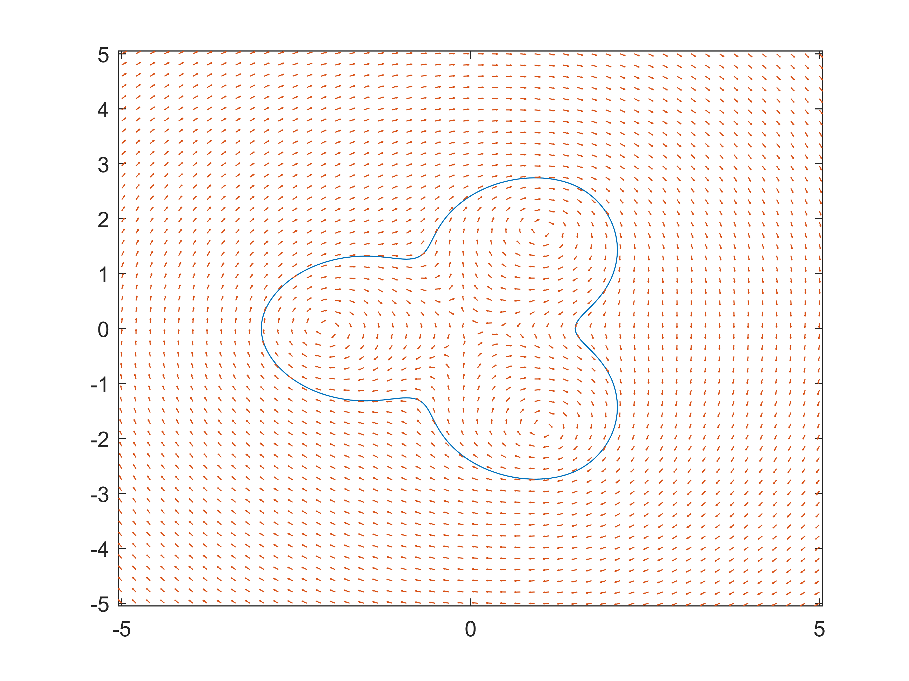
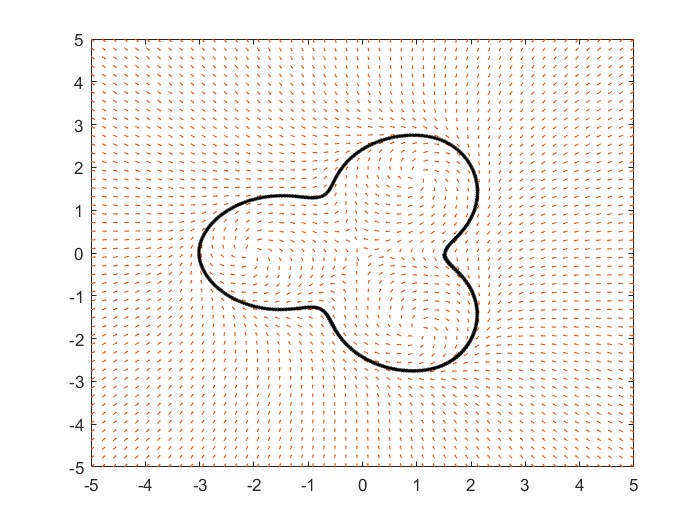
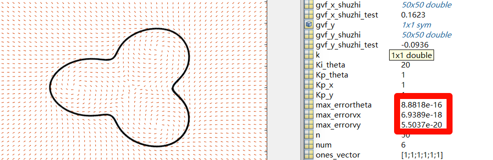
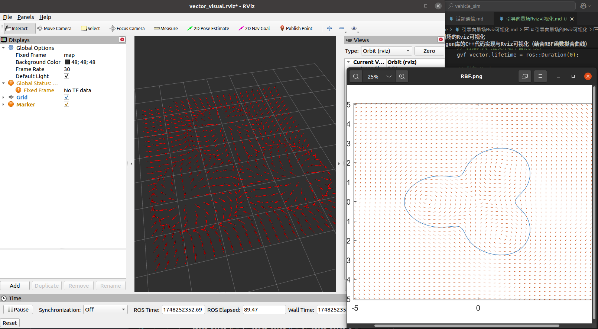

# 月度汇报（5.7 -- 5.27）
关于ROS部分相关学习记录与代码可访问[Github链接](https://github.com/YonderL/Note)获取
## 简单总结
- 完成基于Matlab的导航向量场仿真和路径跟随（质点模型与阿克曼小车运动学模型）
- 完成基于ROS的导航向量场生成
## 下月计划
- 学习Gazebo仿真环境搭建和传感器数据的仿真
- 进行阿克曼小车在ROS下的建模仿真
- 进行阿克曼小车在ROS下的路径跟随仿真
- 编写节点
## 基于Matlab的导航向量场仿真
### 单位圆向量场计算
#### 代码
```Matlab
clear all
close all
n = 60;
R = 10;
k = 0.08;
x = linspace(-15, 15, n);
y = linspace(-15, 15, n);
[X, Y] = meshgrid(x,y);
U = -2*Y - 2*k*X.*(X.^2+Y.^2-R^2);
V = 2*X - 2*k*Y.*(X.^2+Y.^2-R^2);
guiyi = sqrt(U.^2 + V.^2);
U = U ./ guiyi;
V = V ./ guiyi;
quiver(X, Y, U, V, 0.3)
% 添加圆
hold on; % 允许在同一个图形上绘图
theta = linspace(0, 2*pi, 100); % 圆周上的角度
x_circle = R * cos(theta); % 计算圆周上的x坐标
y_circle = R * sin(theta); % 计算圆周上的y坐标
plot(x_circle, y_circle, 'k-', 'LineWidth', 1); % 使用红色线条绘制圆

axis equal; % 设置坐标轴使圆看起来是圆的，而不是椭圆
xlabel('X-axis');
ylabel('Y-axis');
title('Vector Field with a Circle');
```
#### 效果

### RBF径向基核函数拟合曲线并计算向量场
选取论文*Path following using a guiding vector field A brief tutorial*中的案例：
#### 代码
```Matlab
clear all
close all
syms x y
%% 定义参数
k = 10;
n = 50;
chosen_0x = [1.5;1.5;-0.75;-3;-0.75;1.5];
chosen_0y = [0;2.6;1.3;0;-1.3;-2.6];
% chosen_0x = [0;1/6;1/3;1/2;2/3;5/6;1]*pi;
% chosen_0y = [0;1/2;sqrt(3)/2;1;sqrt(3)/2;1/2;0];
axisx = linspace(-5, 5, n);
axisy = linspace(-5, 5, n);
[axisx, axisy] = meshgrid(axisx, axisy);
num = length(chosen_0y);
%% 计算gram矩阵
ones_vector = ones(1,num)';
x_vector = repmat(x,1,num) - chosen_0x';
y_vector = repmat(y,1,num) - chosen_0y';
zixiang = sqrt(x_vector.^2 + y_vector.^2);
fzixiang = zixiang.^2 .* log(zixiang + 1);
[chosen_0x, chosen_0x_t] = meshgrid(chosen_0x, chosen_0x);
dis_x = chosen_0x - chosen_0x_t;
[chosen_0y, chosen_0y_t] = meshgrid(chosen_0y, chosen_0y);
dis_y = chosen_0y - chosen_0y_t;
distance_r = sqrt(dis_x.^2 + dis_y.^2);
gram_matrix = distance_r.^2 .* log(distance_r + 1);
% gram_matrix = exp(-distance_r.^2 / 2);
%% 计算出w
w = inv(gram_matrix) * ones_vector;
out = -1 + fzixiang * w;
fimplicit(out, [-4 3 -2.8 2.8]);
hold on;
%% 计算GVF向量场
E = [0,-1;1,0];
out_derivative_x = diff(out, x);
out_derivative_y = diff(out, y);
out_derivative = [out_derivative_x;out_derivative_y];
gvf = E*out_derivative - k*out*out_derivative;
gvf_x = gvf(1);
gvf_y = gvf(2);
gvf_x_shuzhi = double(subs(gvf_x, [x, y], {axisx, axisy}));
gvf_y_shuzhi = double(subs(gvf_y, [x, y], {axisx, axisy}));
guiyi = sqrt(gvf_x_shuzhi.^2 + gvf_y_shuzhi.^2);
gvf_x_shuzhi = gvf_x_shuzhi ./ guiyi;
gvf_y_shuzhi = gvf_y_shuzhi ./ guiyi;
quiver(axisx, axisy, gvf_x_shuzhi, gvf_y_shuzhi, 0.3)
hold on;
```
#### 效果


### 质点模型的向量场巡线
#### 代码
```Matlab
clear all
close all
syms x y
%% 定义参数
k = 10;
n = 50;
chosen_0x = [1.5;1.5;-0.75;-3;-0.75;1.5];
chosen_0y = [0;2.6;1.3;0;-1.3;-2.6];
% chosen_0x = [0;1/6;1/3;1/2;2/3;5/6;1]*pi; 对于其他曲线的尝试
% chosen_0y = [0;1/2;sqrt(3)/2;1;sqrt(3)/2;1/2;0];
axisx = linspace(-5, 5, n);
axisy = linspace(-5, 5, n);
[axisx, axisy] = meshgrid(axisx, axisy);
num = length(chosen_0y);
%% 计算gram矩阵
ones_vector = ones(1,num)';
x_vector = repmat(x,1,num) - chosen_0x';
y_vector = repmat(y,1,num) - chosen_0y';
zixiang = sqrt(x_vector.^2 + y_vector.^2);
fzixiang = zixiang.^2 .* log(zixiang + 1);
[chosen_0x, chosen_0x_t] = meshgrid(chosen_0x, chosen_0x);
dis_x = chosen_0x - chosen_0x_t;
[chosen_0y, chosen_0y_t] = meshgrid(chosen_0y, chosen_0y);
dis_y = chosen_0y - chosen_0y_t;
distance_r = sqrt(dis_x.^2 + dis_y.^2);
gram_matrix = distance_r.^2 .* log(distance_r + 1);
% gram_matrix = exp(-distance_r.^2 / 2);
%% 计算出w
w = inv(gram_matrix) * ones_vector;
out = -1 + fzixiang * w;
fimplicit(out, [-4 3 -2.8 2.8]);
hold on;
%% 计算GVF向量场
E = [0,-1;1,0];
out_derivative_x = diff(out, x);
out_derivative_y = diff(out, y);
out_derivative = [out_derivative_x;out_derivative_y];
gvf = E*out_derivative - k*out*out_derivative;
gvf_x = gvf(1);
gvf_y = gvf(2);
gvf_x_shuzhi = double(subs(gvf_x, [x, y], {axisx, axisy}));
gvf_y_shuzhi = double(subs(gvf_y, [x, y], {axisx, axisy}));
guiyi = sqrt(gvf_x_shuzhi.^2 + gvf_y_shuzhi.^2);
gvf_x_shuzhi = gvf_x_shuzhi ./ guiyi;
gvf_y_shuzhi = gvf_y_shuzhi ./ guiyi;
quiver(axisx, axisy, gvf_x_shuzhi, gvf_y_shuzhi, 0.3)
hold on;
%% 仿真轨迹
% 初始化
% gvf_x = -2*y - 2*k*x*(x.^2+y^2-1);
% gvf_y = 2*x - 2*k*y*(x^2+y^2-1);
xi = 1.5; yi = 0; theta_i = 0; v = 1; t = 0.05;
Kp_x = 1; Kp_y = 1; Ki_theta = 5;
Ki_x = 0; Ki_y = 0;
vx_i = v * cos(theta_i);
vy_i = v * sin(theta_i);
error_vx = [];
error_vy = [];
error_theta = [];
while 1
    x_past = xi;
    y_past = yi;
    vx_des = double(subs(gvf_x, [x, y], {xi, yi})) ;
    vy_des = double(subs(gvf_y, [x, y], {xi, yi})) ;
    v_guiyi = sqrt(vx_des^2 + vy_des^2) + 1e-10;
    vx_des = vx_des / v_guiyi;
    vy_des = vy_des / v_guiyi;
    vx_i = Kp_x*(vx_des - vx_i) + vx_i;
    vy_i = Kp_y*(vy_des - vy_i) + vy_i;
    error_vx = [error_vx;vx_des - vx_i];
    error_vy = [error_vy;vy_des - vy_i];
    ave_errorvx = mean(abs(error_vx));
    ave_errorvy = mean(abs(error_vy));
    max_errorvx = max(abs(error_vy));
    max_errorvy = max(abs(ave_errorvy));
    xi = xi + vx_i * t;
    yi = yi + vy_i * t;
    
    plot(xi,yi,'-k.');
	hold on;  %保持让上一个点显示
    drawnow;
end
```
#### 效果

### 阿克曼小车（后轮驱动）的导航向量场仿真
```Matlab
clear all
close all
syms x y
%% 定义参数
k = 10;
n = 50;
chosen_0x = [1.5;1.5;-0.75;-3;-0.75;1.5];
chosen_0y = [0;2.6;1.3;0;-1.3;-2.6];
% chosen_0x = [0;1/6;1/3;1/2;2/3;5/6;1]*pi;
% chosen_0y = [0;1/2;sqrt(3)/2;1;sqrt(3)/2;1/2;0];
axisx = linspace(-5, 5, n);
axisy = linspace(-5, 5, n);
[axisx, axisy] = meshgrid(axisx, axisy);
num = length(chosen_0y);
%% 计算gram矩阵
ones_vector = ones(1,num)';
x_vector = repmat(x,1,num) - chosen_0x';
y_vector = repmat(y,1,num) - chosen_0y';
zixiang = sqrt(x_vector.^2 + y_vector.^2);
fzixiang = zixiang.^2 .* log(zixiang + 1);
[chosen_0x, chosen_0x_t] = meshgrid(chosen_0x, chosen_0x);
dis_x = chosen_0x - chosen_0x_t;
[chosen_0y, chosen_0y_t] = meshgrid(chosen_0y, chosen_0y);
dis_y = chosen_0y - chosen_0y_t;
distance_r = sqrt(dis_x.^2 + dis_y.^2);
gram_matrix = distance_r.^2 .* log(distance_r + 1);
% gram_matrix = exp(-distance_r.^2 / 2);
%% 计算出w
w = inv(gram_matrix) * ones_vector;
out = -1 + fzixiang * w;
fimplicit(out, [-4 3 -2.8 2.8]);
hold on;
%% 计算GVF向量场
E = [0,-1;1,0];
out_derivative_x = diff(out, x);
out_derivative_y = diff(out, y);
out_derivative = [out_derivative_x;out_derivative_y];
gvf = E*out_derivative - k*out*out_derivative;
gvf_x = gvf(1);
gvf_y = gvf(2);
gvf_x_shuzhi = double(subs(gvf_x, [x, y], {axisx, axisy}));
gvf_y_shuzhi = double(subs(gvf_y, [x, y], {axisx, axisy}));
guiyi = sqrt(gvf_x_shuzhi.^2 + gvf_y_shuzhi.^2);
gvf_x_shuzhi = gvf_x_shuzhi ./ guiyi;
gvf_y_shuzhi = gvf_y_shuzhi ./ guiyi;
quiver(axisx, axisy, gvf_x_shuzhi, gvf_y_shuzhi, 0.3)
hold on;
%% 仿真轨迹
% 初始化
xi = 1.5; yi = 0; theta_i = 0; v_i = 0; Steering_angle = 0; Steering_angle_tan = 0; t = 0.05; zhoujv = 0.5; 
Kp_x = 1; Kp_y = 1; Ki_theta = 20; Kp_theta = 1;

error_vx = [];
error_vy = [];
error_theta = [];
while 1
    vx_i = v_i * cos(theta_i); vy_i = v_i * sin(theta_i); thetaspeed_i = v_i * Steering_angle_tan/zhoujv;
    x_past = xi;
    y_past = yi;
    vx_des = double(subs(gvf_x, [x, y], {xi, yi})) ;
    vy_des = double(subs(gvf_y, [x, y], {xi, yi})) ;
    v_guiyi = sqrt(vx_des^2 + vy_des^2) + 1e-10;
    vx_des = vx_des / v_guiyi;
    vy_des = vy_des / v_guiyi;
    theta_des = atan2(vy_des, vx_des);
    if theta_des < 0
        theta_des = theta_des + 2 * pi;
    end
    vx_i = Kp_x*(vx_des - vx_i) + vx_i;
    vy_i = Kp_y*(vy_des - vy_i) + vy_i;
    thetaspeed_i = Ki_theta*(theta_des - theta_i) + (1- Kp_theta) * thetaspeed_i;
    error_vx = [error_vx;vx_des - vx_i];
    error_vy = [error_vy;vy_des - vy_i];
    ave_errorvx = mean(abs(error_vx));
    ave_errorvy = mean(abs(error_vy));
    max_errorvx = max(abs(error_vy));
    max_errorvy = max(abs(ave_errorvy));
    xi = xi + vx_i * t;
    yi = yi + vy_i * t;
    theta_i = theta_i + thetaspeed_i * t;
    error_theta = [error_theta;theta_des - theta_i];
    ave_errortheta = mean(abs(error_theta));
    max_errortheta = max(abs(error_theta));
    if theta_i > 2*pi
        theta_i = theta_i - 2*pi;
    end
    v_i = sqrt(vx_i^2 + vy_i^2);
    Steering_angle_tan = zhoujv*thetaspeed_i/v_i;
    Steering_angle = atan(Steering_angle_tan);

    plot(xi,yi,'-k.');
	hold on;  %保持让上一个点显示
    drawnow;
end
```
#### 效果

## 基于ROS的导航向量场仿真
### 代码
借助Eigen库进行矩阵运算，使用数值法进行近似求导，结果精度与Matlab近似，在Rviz下可视化：
```C++
#include <Eigen/Eigen>
#include <Eigen/Dense>
#include <Eigen/Geometry>
#include <Eigen/Eigenvalues>
#include <iostream>
#include <cmath>
#include "ros/ros.h"
#include "std_msgs/Float32MultiArray.h"
#include <visualization_msgs/Marker.h>
struct GVF_vector {
    double x;
    double y;
};

double RBF_function(std::vector<double>& w_array, std::vector<double>& px_array, std::vector<double>& py_array, int num, double x, double y){
    double summary = 0;
    for (size_t i = 0; i < num; i++)
    {
        summary += w_array[i]*(pow(x-px_array[i], 2) + pow(y-py_array[i], 2))*log(std::sqrt(pow(x-px_array[i], 2) + pow(y-py_array[i], 2)) + 1);
    }
    summary -= 1;
    return summary;
}
//中心差分近似求导
double approximate_derivative_opt_x(std::vector<double>& w_array, std::vector<double>& px_array, std::vector<double>& py_array, int num, double x, double y, double h = 1e-3){
    return (RBF_function(w_array, px_array, py_array, num,x+h,y)-RBF_function(w_array, px_array, py_array, num,x-h,y))/(2*h);
}
double approximate_derivative_opt_y(std::vector<double>& w_array, std::vector<double>& px_array, std::vector<double>& py_array, int num, double x, double y, double h = 1e-3){
    return (RBF_function(w_array, px_array, py_array, num,x,y+h)-RBF_function(w_array, px_array, py_array, num,x,y-h))/(2*h);
}
GVF_vector gvf_function(std::vector<double>& w_array, std::vector<double>& px_array, std::vector<double>& py_array, int num, double x, double y){
    int k = 50;
    double derivate_x = approximate_derivative_opt_x(w_array, px_array, py_array, num, x, y);
    double derivate_y = approximate_derivative_opt_y(w_array, px_array, py_array, num, x, y);
    Eigen::MatrixXd derivate_xy(2, 1);
    Eigen::MatrixXd rotationmatrix(2, 2);
    Eigen::MatrixXd gvf_fun(2,1);
    Eigen::MatrixXd gvf_visual(2,1);
    derivate_xy << derivate_x, derivate_y;
    rotationmatrix << 0, -1, 1, 0;
    gvf_fun = rotationmatrix*derivate_xy - k*RBF_function(w_array, px_array, py_array, num, x, y)*derivate_xy;
    GVF_vector gvf_value;
    gvf_value.x = gvf_fun(0);
    gvf_value.y = gvf_fun(1);
    return gvf_value;
}

int main(int argc, char *argv[]){
    int num = 6;
    Eigen::MatrixXd p_x(1, num);
    Eigen::MatrixXd dis_x(num, num);
    Eigen::MatrixXd p_y(1, num);
    Eigen::MatrixXd dis_y(num, num);
    Eigen::MatrixXd dis_sqr(num, num);
    Eigen::MatrixXd dis_r(num, num);
    Eigen::MatrixXd w(num, 1);
    std_msgs::Float32MultiArray msg;
    p_x << 1.5, 1.5, -0.75, -3, -0.75, 1.5;
    p_y << 0, 2.6, 1.3, 0, -1.3, -2.6;
    Eigen::MatrixXd mat_x = p_x.replicate(num, 1); // 该函数将p_x作为一个矩阵元素，填充出n*m的矩阵
    Eigen::MatrixXd mat_y = p_y.replicate(num, 1);
    mat_x = mat_x - p_x.transpose().replicate(1, num);
    mat_y = mat_y - p_y.transpose().replicate(1, num);
    dis_x = mat_x.cwiseProduct(mat_x); //对应位置相乘
    dis_y = mat_y.cwiseProduct(mat_y);
    dis_sqr = dis_x + dis_y;
    dis_r = dis_sqr.unaryExpr([](double x){return std::sqrt(x);});
    dis_r = dis_r.unaryExpr([](double x){return x*x*log(x+1);});
    dis_r = dis_r.inverse();
    w = dis_r.rowwise().sum();
    std::vector<double> w_array(w.data(), w.data() + w.rows() * w.cols());
    std::vector<double> px_array(p_x.data(), p_x.data() + p_x.rows() * p_x.cols());
    std::vector<double> py_array(p_y.data(), p_y.data() + p_y.rows() * p_y.cols());
    gvf_function(w_array, px_array, py_array, num, 1.5, 2.6);
    ros::init(argc, argv, "GVF");
    ros::NodeHandle nh;
    ros::Publisher pub = nh.advertise<visualization_msgs::Marker>("GVF_Visual", 1);
    ros::Rate r(10);
    int vector_id = 0;
    for(double i=-3.8; ros::ok()&&i <= 3;i=i+0.25){
        for(double j=-2.8;ros::ok()&&j<=2.7;j=j+0.25){
            visualization_msgs::Marker gvf_vector;
            gvf_vector.header.frame_id = "map";
            gvf_vector.header.stamp = ros::Time::now();
            gvf_vector.ns = "vector_namespace";
            gvf_vector.id = vector_id;
            vector_id ++;
            gvf_vector.type = visualization_msgs::Marker::ARROW;
            gvf_vector.action = visualization_msgs::Marker::ADD;
            geometry_msgs::Point start_point, end_point;
            GVF_vector gvf_value;
            gvf_value = gvf_function(w_array, px_array, py_array, num, i, j);
            double gvf_module = std::sqrt(pow(gvf_value.x,2)+pow(gvf_value.y, 2));
            
            start_point.x = i; start_point.y = j; start_point.z = 0.0;
            end_point.x = i + 0.25*gvf_value.x/gvf_module; end_point.y = j + 0.25*gvf_value.y/gvf_module, end_point.z = 0.0;  // 矢量方向

            gvf_vector.points.push_back(start_point);
            gvf_vector.points.push_back(end_point);

            // 尺寸（线宽）
            gvf_vector.scale.x = 0.01;  // 箭杆宽度
            gvf_vector.scale.y = 0.05;   // 箭头宽度
            gvf_vector.scale.z = 0.1;   // 箭头长度

            // 颜色（RGBA）
            gvf_vector.color.r = 1.0f;
            gvf_vector.color.g = 0.0f;
            gvf_vector.color.b = 0.0f;
            gvf_vector.color.a = 1.0;

            // 持续时间（如果不希望自动消失）
            gvf_vector.lifetime = ros::Duration(0);

            // 发布 Marker
            pub.publish(gvf_vector);

            ros::spinOnce();
            r.sleep();
        }
    }

    return 0;
} 
```
### 效果
左侧为Rviz可视化，右侧为matlab的结果，可以看到二者基本相同
