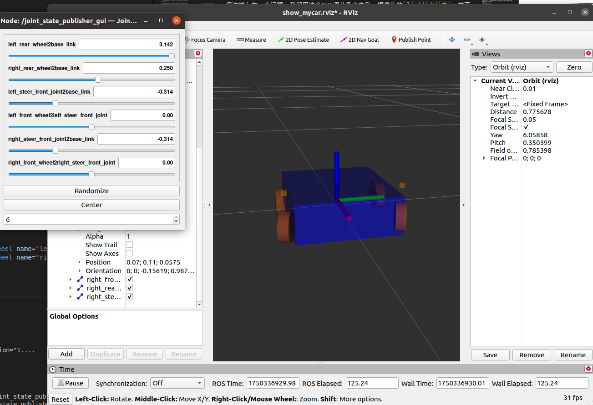
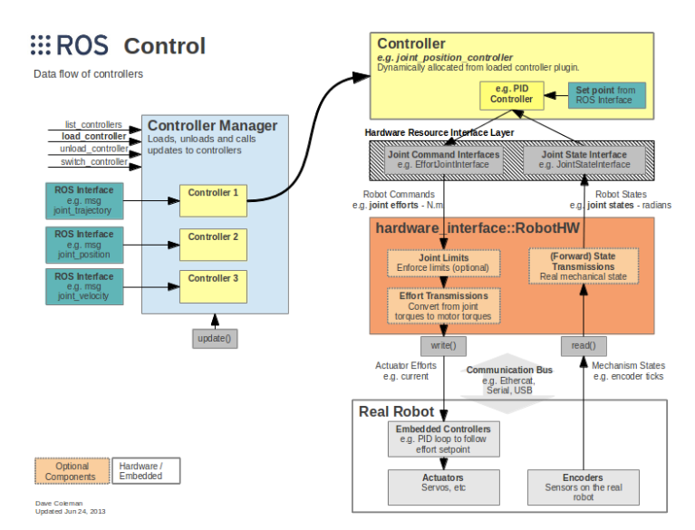

# 阿克曼底盘的URDF建模与Gazebo控制（使用Xacro优化）

## 阿克曼底盘建模
### 建模
我们使用后轮驱动，前轮转向的阿克曼底盘模型。\
那么对于后轮只需进行正常的`continous joint`连接即可\
对于前轮，有两个自由度，旋转和转向，而且由于`URDF`无法进行闭链关节建模，因此我们模拟一个转向杆，使用`revolute joint`限定转向角度首先将`base_link`与转向杆连接，之后使用`continous joint`将转向杆与车轮相连。\
如下为具体实现：
```xml
<robot name="akeman_base" xmlns:xacro="http://www.ros.org/wiki/xacro">
    <xacro:property name="PI" value="3.1415926" />
    <xacro:property name="wheel_radius" value="0.03" />
    <xacro:property name="wheel_height" value="0.02" />
    <xacro:property name="wheel_in" value="0.0125" />
    <xacro:property name="base_linkheight" value="0.075" />
    <xacro:property name="base_length" value="0.225" />
    <xacro:property name="base_width" value="0.2" />
    <xacro:property name="base_height" value="0.01" />

    <link name="base_footprint">
        <visual>
            <geometry>
                <sphere radius="0.001" />
            </geometry>
            <origin xyz="0 0 0" rpy="0 0 0" />
            <material name="yellow">
                <color rgba="0.8 0.3 0.1 0.5" />
            </material> 
        </visual>
    </link>

    <link name="base_link">
        <visual>
            <geometry>
                <box size="${base_length} ${base_width} ${base_linkheight}" />
            </geometry>
            <origin xyz="0 0 0" rpy="0 0 0" />
            <material name="blue">
                <color rgba="0 0 1.0 0.5" />
            </material>
        </visual>
    </link>

    <joint name="base_link2base_footlink" type="fixed">
        <parent link="base_footprint" />
        <child link="base_link" />
        <origin xyz="0 0 ${base_height}" rpy="0 0 0" />
    </joint>

    <xacro:macro name="define_rear_wheel" params="name flag">
        <link name="${name}_rear_wheel">
            <visual>
                <geometry>
                    <cylinder radius="${wheel_radius}" length="${wheel_height}" />
                </geometry>
                <origin xyz="0 0 0" rpy="${flag*PI/2} 0 0" />
                <material name="yellow">
                    <color rgba="0.8 0.3 0.1 0.5" />
                </material>
            </visual>
        </link>
        <joint name="${name}_rear_wheel2base_link" type="continuous">
            <parent link="base_link" />
            <child link="${name}_rear_wheel" />
            <origin xyz="${-(-wheel_in-wheel_radius+base_length/2)} ${flag*(wheel_height/2 + base_width/2)} ${-(base_linkheight/2+base_height-wheel_radius)}" />
            <axis xyz="0 1 0" />
        </joint>
    </xacro:macro>
    <xacro:define_rear_wheel name="left" flag="1" />
    <xacro:define_rear_wheel name="right" flag="-1" />

    <xacro:macro name="define_front_wheel" params="name flag">
        <link name="${name}_front_wheel">
            <visual>
                <geometry>
                    <cylinder radius="${wheel_radius}" length="${wheel_height}" />
                </geometry>
                <origin xyz="0 0 0" rpy="${flag*PI/2} 0 0" />
                <material name="yellow">
                    <color rgba="0.8 0.3 0.1 0.5" />
                </material>
            </visual>
        </link>
        <link name="${name}_steer_front_joint">
            <visual>
                <geometry>
                    <box size="0.01 0.01 0.01" />
                </geometry>
                <origin xyz="0 0 0" rpy="0 0 0" />
                <material name="black">
                    <color rgba="0.7 0.5 0 0.5" />
                </material>
            </visual>
        </link>

        <joint name="${name}_steer_front_joint2base_link" type="revolute">
            <parent link="base_link" />
            <child link="${name}_steer_front_joint" />
            <origin xyz="${-wheel_in-wheel_radius+base_length/2} ${flag*(wheel_height/2 + base_width/2)} ${0.01 + base_linkheight/2}" />
            <axis xyz="0 0 1" />
            <limit lower="-0.69" upper="0.69" effort="0" velocity="3"/>
        </joint>

        <joint name="${name}_front_wheel2${name}_steer_front_joint" type="continuous">
            <parent link="${name}_steer_front_joint" />
            <child link="${name}_front_wheel" />
            <origin xyz="0 0 ${-(0.01+base_linkheight+base_height-wheel_radius)}" />
            <axis xyz="0 1 0" />
        </joint>
    </xacro:macro>
    <xacro:define_front_wheel name="left" flag="1" />
    <xacro:define_front_wheel name="right" flag="-1" />

</robot>
```
### 效果
如下图，可以看到前轮可以通过`GUI`旋转`steer_link`实现转向


## URDF集成Gazebo
较之于 rviz，gazebo在集成 URDF 时，需要做些许修改：
1. 必须添加 collision 碰撞属性相关参数
2. 必须添加 inertial 惯性矩阵相关参数
3. Gazebo颜色设置也必须做相应的变更
### collision 碰撞属性
如果机器人link是标准的几何体形状，和link的visual属性设置一致即可,但没有颜色属性
### inertial 惯性矩阵
对于标准几何体的惯性矩阵，有标准公式，因此我们可以使用一个专门的Xacro文件利用宏封装这些标准几何体的惯性矩阵的公式，之后在其他Xacro文件中包含并调用即可;
```xml
<robot name="base" xmlns:xacro="http://wiki.ros.org/xacro">
    <!-- Macro for inertia matrix 球体 圆柱体 立方体-->
    <xacro:macro name="sphere_inertial_matrix" params="m r">
        <inertial>
            <mass value="${m}" />
            <inertia ixx="${2*m*r*r/5}" ixy="0" ixz="0"
                iyy="${2*m*r*r/5}" iyz="0" 
                izz="${2*m*r*r/5}" />
        </inertial>
    </xacro:macro>

    <xacro:macro name="cylinder_inertial_matrix" params="m r h">
        <inertial>
            <mass value="${m}" />
            <inertia ixx="${m*(3*r*r+h*h)/12}" ixy = "0" ixz = "0"
                iyy="${m*(3*r*r+h*h)/12}" iyz = "0"
                izz="${m*r*r/2}" /> 
        </inertial>
    </xacro:macro>

    <xacro:macro name="Box_inertial_matrix" params="m l w h">
       <inertial>
               <mass value="${m}" />
               <inertia ixx="${m*(h*h + l*l)/12}" ixy = "0" ixz = "0"
                   iyy="${m*(w*w + l*l)/12}" iyz= "0"
                   izz="${m*(w*w + h*h)/12}" />
       </inertial>
   </xacro:macro>
</robot>
```
### 颜色设置
在Gazebo中显示link的颜色，必须指定标签，使用如下指令，该指令与link平级
```xml
<gazebo reference="link节点名称">
     <material>Gazebo/Blue</material>
</gazebo>
```

### URDF在Gazebo下可视化
```xml
<launch>
    <!-- 将 Urdf 文件的内容加载到参数服务器 -->
    <param name="robot_description" command="$(find xacro)/xacro $(find urdf_rviz)/urdf/xacro/akeman_base.xacro" />
    <!-- 启动 gazebo -->
    <include file="$(find gazebo_ros)/launch/empty_world.launch" />

    <!-- 在 gazebo 中显示机器人模型 -->
    <node pkg="gazebo_ros" type="spawn_model" name="model" args="-urdf -model akemanbase -param robot_description"  />
</launch>
```


## Gazebo与ROS_control
在前面Rviz中，我们使用了joint_state_publisher_gui节点来控制关节的转动，但是也只是转动，没有任何的物理属性，例如我们转动车轮关节，小车并不会移动。Gazebo相对于Rviz的优点也在于此，Gazebo有真实的物理引擎，可以通过给关节加入传动装置实现运动控制。
具体使用Gazebo仿真，我们借助ROS_Control软件包实现，其工作流图下图可以很好的展现（源自ROS wiki）：
其主要由以下几部分组成：
- Controller Manager 控制器管理器：管理不同控制器的通用接口
- Controller 控制器：读取硬件资源接口中的状态，运行PID等控制器发布控制指令。不直接接触硬件，也从硬件抽象层请求读取资源
- RobotHW 机器人硬件抽象：可以直接和硬件资源交互，通过 write 和 read 方法完成硬件操作。管理硬件资源，处理硬件冲突
- Hardware Resource 硬件资源：提供硬件资源的接口，包含硬件关节限制、传动机构等，我们配置传动机构实际就是配置硬件资源

## 传动装置Transmission的添加
传动系统用于将机器人的关节指令转换成执行器的控制信号，可在机器人的URDF模型文件中配置。下面为一个Transmission的示例：
```xml
<transmission name="trans_name" > 
    <type>transmission_interface/SimpleTransmission</type>
    <joint name="foo_joint">
        <hardwareInterface>EffortJointInterface</hardwareInterface>
    </joint>
    <actuator name="foo_motor">
        <mechanicalReduction>50</mechanicalReduction>
        <hardwareInterface>EffortJointInterface</hardwareInterface>
    </actuator>
</transmission>
```
- `<transmission name="trans_name" > `定义传动机构名称
- `<joint name="foo_joint">` 指定传动装置对应关节
  - `<hardwareInterface>` 定义硬件接口，选用力关节接口即可
- `<actuator name="foo_motor">` 定义传动执行器
  - `<mechanicalReduction>50</mechanicalReduction>`定义了电机／关节减速比
  - `<hardwareInterface>EffortJointInterface</hardwareInterface>`定义了支持的硬件接口
  - `<motorTorqueConstant>`（可选）定义了电机的转矩参数
在我们的阿克曼小车模型中，我们需要对后轮增加两个旋转电机，前轮增加两个舵机控制角度。对应的关节分别为`${name}_rear_wheel2base_link`和`${name}_front_wheel2${name}_steer_front_joint`。
加入传动装置后，我们还需要加入插件进行gazebo和ros_control的对接，gazebo_ros_control是Gazebo的一个插件用来根据设定装载合适的硬件接口和控制器。示例如下：
```xml
<gazebo>
	<plugin name="gazebo_ros_control" filename="libgazebo_ros_control.so">
		<robotNamespace></robotNamespace>
		<robotParam>robot_description</robotParam>
		<robotSimType>gazebo_ros_control/DefaultRobotHWSim</robotSimType>
		<legacyModeNS>true</legacyModeNS>
	</plugin>
</gazebo>
```
- `<robotNamespace>`用来定义插件其对象的ROS命名空间，默认是URDF或者SDF对应的机器人名称。
- `<contolPeriod>`用来定义控制器的更新周期，单位为秒，默认使用Gazebo的周期。
- `<robotParam>`用来定义ROS参数服务器上的机器人描述(URDF)路径，默认是"/robot_description"。
- `<robotSimType>`用来定义机器人仿真接口所使用的插件库名称，默认是"DefaultRobotHWSim"。
- `<legacyModeNS>`用来兼容之前ROS版本的配置。
另外，也可以添加属性`reference`，这样它就是对整个机器人`<robot>`的描述。

## Controller 控制器
对于Akermann小车，我们可以借助ros-controllers软件包下的ackermann_steering_controller来实现，但需要额外安装，运行以下指令即可。
```
sudo apt-get install ros-noetic-ros-control ros-noetic-ros-controllers
```
此外，steer_bot_hardware_gazebo支持四轮控制器，但该软件包最高只支持到了melodic版本（可以在github查阅下载编译），本人使用的是noetic版本，所以无法安装。
如果使用鱼香ROS一键安装，则需要再次使用一键安装中的配置系统源中重新配置更换系统源和加入ROS源。

查阅ROS wiki，可以发现ackermann_steering_controller仅支持前后两个轮的小车模型，因此我们需要对模型进行一定的修改，方便进行控制。
在两后轮之间加入一个虚拟轮，该虚拟后轮首先与基座之间形成continous joint，再和两个后轮分别形成continous joint，此时旋转虚拟后轮则相当于旋转两个后轮。
将前向的两个模拟转向关节合为一个，旋转合并后的关节就相当于同时进行两个轮转向。
修改并加入transmission的xacro文件如下：
```xml
<robot name="ackermann_base" xmlns:xacro="http://www.ros.org/wiki/xacro">
    <!-- 参数 -->
    <xacro:property name="PI" value="3.1415926" />
    <!-- 车轮参数 -->
    <xacro:property name="wheel_radius" value="0.03" />
    <xacro:property name="wheel_height" value="0.05" />
    <xacro:property name="wheel_in" value="0.0125" />
    <!-- 基座参数 -->   
    <xacro:property name="base_linkheight" value="0.075" />
    <xacro:property name="base_length" value="0.225" />
    <xacro:property name="base_width" value="0.2" />
    <!-- 基座离地高度 -->
    <xacro:property name="base_ground_clearance" value="0.03" />
    <!-- 质量参数 -->
    <xacro:property name="base_m" value="2" />
    <xacro:property name="wheel_m" value="0.5" />  
    <xacro:property name="virtual_wheel_m" value="0.1" /> 
    <xacro:property name="virtual_wheel_size" value="0.03" />

    <!-- 基座base_link -->
    <xacro:include filename="inertial_matrix.xacro" />
    <link name="base_footprint">
        <visual>
            <geometry>
                <sphere radius="0.001" />
            </geometry>
            <origin xyz="0 0 0" rpy="0 0 0" />
            <material name="yellow">
                <color rgba="0.8 0.3 0.1 0.5" />
            </material> 
        </visual>
        <collision>
            <geometry>
                <sphere radius="0.001" />
            </geometry>
            <origin xyz="0 0 0" rpy="0 0 0" />
        </collision>
    </link>

    <link name="base_link">
        <visual>
            <geometry>
                <box size="${base_length} ${base_width} ${base_linkheight}" />
            </geometry>
            <origin xyz="0 0 0" rpy="0 0 0" />
            <material name="blue">
                <color rgba="0 0 1.0 0.5" />
            </material>
        </visual>
        <collision>
            <geometry>
                <box size="${base_length} ${base_width} ${base_linkheight}" />
            </geometry>
            <origin xyz="0 0 0" rpy="0 0 0" />
        </collision>
        <xacro:Box_inertial_matrix m="${base_m}" l="${base_length}" w="${base_width}" h="${base_linkheight}" />
    </link>
    <gazebo reference="base_link">
        <material>Gazebo/Blue</material>
    </gazebo>
    <joint name="base_link2base_footlink" type="fixed">
        <parent link="base_footprint" />
        <child link="base_link" />
        <origin xyz="0 0 ${base_ground_clearance + base_linkheight/2}" rpy="0 0 0" />
    </joint>
    
    <!-- 建立虚拟关节 -->
    <!-- 后驱动轮虚拟link -->
    <xacro:macro name="define_virtual_rear_wheel" params="name flag con_axis_y con_axis_z">
        <link name="${name}_virtual_wheel">
            <visual>
                <geometry>
                    <sphere radius="${virtual_wheel_size}" />
                </geometry>
                <origin xyz="0 0 0" rpy="0 0 0" />
                <material name="yellow">
                    <color rgba="0.8 0.3 0.1 0.5" />
                </material>
            </visual>
            <collision>
                <geometry>
                    <sphere radius="${virtual_wheel_size}" />
                </geometry>
                <origin xyz="0 0 0" rpy="0 0 0" />
            </collision>
            <xacro:sphere_inertial_matrix m="${virtual_wheel_m}" r="${virtual_wheel_size}" />
        </link>
        <joint name="${name}_virtual_wheel2base_link" type="continuous">
            <parent link="base_link" />
            <child link="${name}_virtual_wheel" />
            <origin xyz="${flag*(-wheel_in-wheel_radius+base_length/2)} 0 ${-(base_linkheight/2 + wheel_radius)}" />
            <axis xyz="0 ${con_axis_y} ${con_axis_z}" />
        </joint>
        <gazebo reference="${name}_virtual_wheel">
            <material>Gazebo/Yellow</material>
        </gazebo>
    </xacro:macro>
    
    <xacro:macro name="define_virtual_front_wheel" params="name flag con_axis_y con_axis_z">
        <link name="${name}_virtual_wheel">
            <visual>
                <geometry>
                    <sphere radius="${virtual_wheel_size}" />
                </geometry>
                <origin xyz="0 0 0" rpy="0 0 0" />
                <material name="yellow">
                    <color rgba="0.8 0.3 0.1 0.5" />
                </material>
            </visual>
            <collision>
                <geometry>
                    <sphere radius="${virtual_wheel_size}" />
                </geometry>
                <origin xyz="0 0 0" rpy="0 0 0" />
            </collision>
            <xacro:sphere_inertial_matrix m="${virtual_wheel_m}" r="${virtual_wheel_size}" />
        </link>
        <joint name="${name}_virtual_wheel2base_link" type="revolute">
            <parent link="base_link" />
            <child link="${name}_virtual_wheel" />
            <origin xyz="${flag*(-wheel_in-wheel_radius+base_length/2)} 0 ${-(base_linkheight/2 + wheel_radius)}" />
            <axis xyz="0 ${con_axis_y} ${con_axis_z}" />
            <limit lower="-0.69" upper="0.69" effort="0" velocity="3"/>
        </joint>
        <gazebo reference="${name}_virtual_wheel">
            <material>Gazebo/Yellow</material>
        </gazebo>
    </xacro:macro>
    <xacro:define_virtual_front_wheel name="front" flag="1" con_axis_y="0" con_axis_z="1" />
    <xacro:define_virtual_rear_wheel name="rear" flag="-1" con_axis_y="1" con_axis_z="0"/>

    <xacro:macro name="define_rear_wheel" params="name flag">
        <link name="${name}_rear_wheel">
            <visual>
                <geometry>
                    <cylinder radius="${wheel_radius}" length="${wheel_height}" />
                </geometry>
                <origin xyz="0 0 0" rpy="${flag*PI/2} 0 0" />
                <material name="yellow">
                    <color rgba="0.8 0.3 0.1 0.5" />
                </material>
            </visual>
            <collision>
                <geometry>
                    <cylinder radius="${wheel_radius}" length="${wheel_height}" />
                </geometry>
                <origin xyz="0 0 0" rpy="${flag*PI/2} 0 0" />
            </collision>
            <xacro:cylinder_inertial_matrix m="${wheel_m}" r="${wheel_radius}" h="${wheel_height}" />
        </link>
        <joint name="${name}_rear_wheel2rear_virtual_wheel" type="continuous">
            <parent link="rear_virtual_wheel" />
            <child link="${name}_rear_wheel" />
            <origin xyz="0 ${flag*(base_width/2-wheel_height/2)} 0" />
            <axis xyz="0 1 0" />
        </joint>
        <gazebo reference="${name}_rear_wheel">
            <material>Gazebo/Yellow</material>
        </gazebo>
    </xacro:macro>
    <xacro:define_rear_wheel name="left" flag="1" />
    <xacro:define_rear_wheel name="right" flag="-1" />


    <xacro:macro name="define_front_wheel" params="name flag">
        <link name="${name}_front_wheel">
            <visual>
                <geometry>
                    <cylinder radius="${wheel_radius}" length="${wheel_height}" />
                </geometry>
                <origin xyz="0 0 0" rpy="${flag*PI/2} 0 0" />
                <material name="yellow">
                    <color rgba="0.8 0.3 0.1 0.5" />
                </material>
            </visual>
            <collision>
                <geometry>
                    <cylinder radius="${wheel_radius}" length="${wheel_height}" />
                </geometry>
                <origin xyz="0 0 0" rpy="${flag*PI/2} 0 0" />
            </collision>
            <xacro:cylinder_inertial_matrix m="${wheel_m}" r="${wheel_radius}" h="${wheel_height}" />
        </link>

        <joint name="${name}_front_wheel2front_virtual_wheel" type="continuous">
            <parent link="front_virtual_wheel" />
            <child link="${name}_front_wheel" />
            <origin xyz="0 ${flag*(base_width/2-wheel_height/2)} 0" />
            <axis xyz="0 1 0" />
        </joint>

        <gazebo reference="${name}_front_wheel">
            <material>Gazebo/Yellow</material>
        </gazebo>
    </xacro:macro>
    <xacro:define_front_wheel name="left" flag="1" />
    <xacro:define_front_wheel name="right" flag="-1" />

    <transmission name="front_virtual_wheel2base_link_trans" >
        <type>transmission_interface/SimpleTransmission</type>
        <joint name="front_virtual_wheel2base_link">
            <hardwareInterface>hardware_interface/PositionJointInterface</hardwareInterface>
        </joint>
        <actuator name="front_virtual_wheel2base_link_motor">
            <mechanicalReduction>1</mechanicalReduction>
            <hardwareInterface>hardware_interface/PositionJointInterface</hardwareInterface>
        </actuator>
    </transmission>
    <transmission name="rear_virtual_wheel2base_link_trans" >
        <type>transmission_interface/SimpleTransmission</type>
        <joint name="rear_virtual_wheel2base_link">
            <hardwareInterface>hardware_interface/VelocityJointInterface</hardwareInterface>
        </joint>
        <actuator name="rear_virtual_wheel2base_link_motor">
            <mechanicalReduction>1</mechanicalReduction>
            <hardwareInterface>hardware_interface/VelocityJointInterface</hardwareInterface>
        </actuator>
    </transmission>
    <gazebo>
        <plugin name="gazebo_ros_control" filename="libgazebo_ros_control.so">
            <robotNamespace></robotNamespace>
            <robotParam>robot_description</robotParam>
            <robotSimType>gazebo_ros_control/DefaultRobotHWSim</robotSimType>
            <legacyModeNS>true</legacyModeNS>
        </plugin>
    </gazebo>
</robot>
```